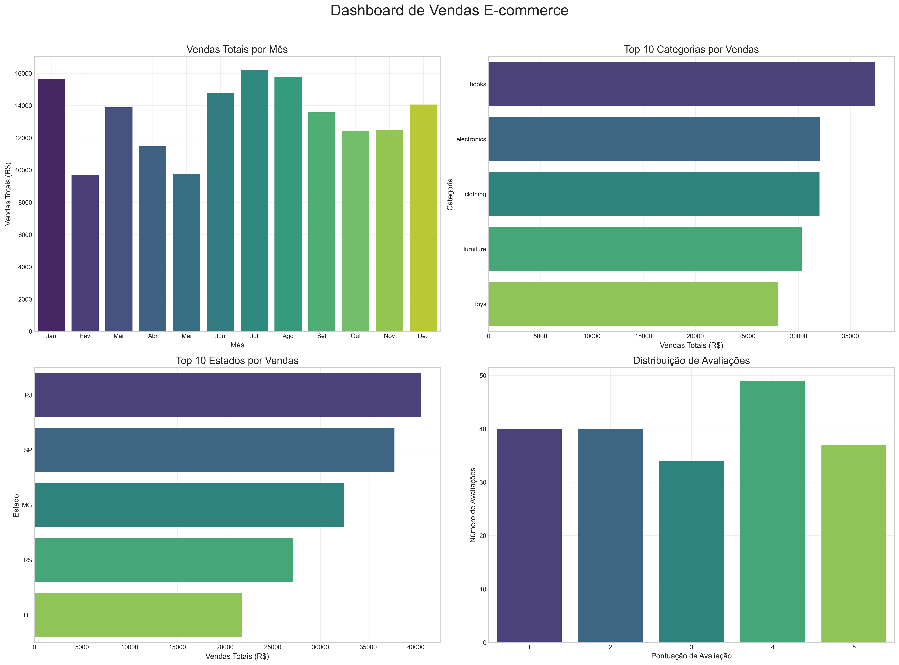

# ETL e Dashboard com Python e Power BI

## Sobre o Projeto
Este projeto demonstra um pipeline completo de ETL (Extração, Transformação e Carga) usando Python para processar dados de e-commerce e criar dashboards interativos no Power BI.

## Principais Recursos
- Pipeline ETL completo implementado em Python
- Extração de dados de múltiplas fontes
- Transformação e limpeza de dados com pandas
- Integração direta com Power BI
- Dashboard interativo com KPIs de vendas e desempenho

## Estrutura do Projeto
- `notebooks/`: Jupyter notebooks com o processo ETL detalhado
- `data/`: Dados brutos, processados e transformados
- `src/`: Scripts Python para extração e transformação
- `reports/dashboard/`: Arquivos do Power BI e imagens do dashboard

## Como Executar
1. Clone este repositório
2. Instale as dependências: `pip install -r requirements.txt`
3. Execute os notebooks na ordem numérica
4. Abra o arquivo .pbix no Power BI Desktop

## Tecnologias Utilizadas
- Python 3.9
- pandas 1.5.3
- numpy 1.24.3
- SQLAlchemy 2.0.15
- Power BI Desktop

## Dados
Os dados utilizados são do [Brazilian E-Commerce Public Dataset by Olist](https://www.kaggle.com/datasets/olistbr/brazilian-ecommerce), disponibilizados no Kaggle.

## Autor
Douglas Rodrigues - [LinkedIn](https://www.linkedin.com/in/douglas-rodrigues-da-silva-30a018222/)
